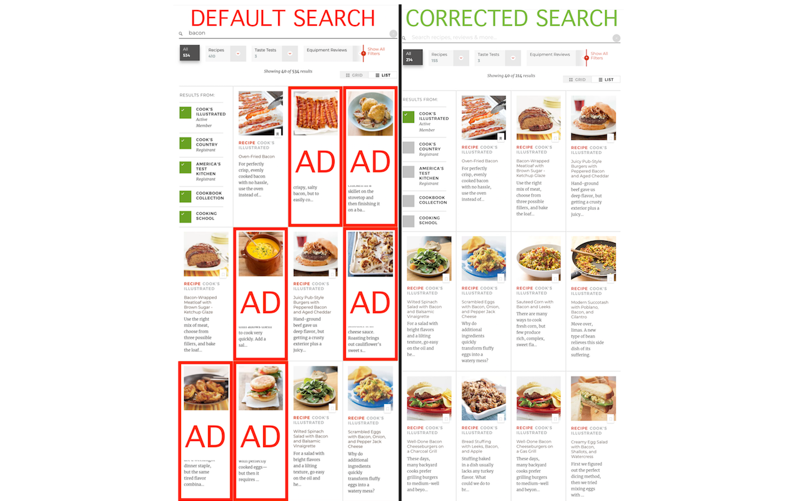

# Cook's Illustrated Exclusive Search

By default, [Cook's Illustrated](https://www.cooksillustrated.com) includes search 
results from all its network sites, even if you do not have a membership to those 
other sites. These search results are advertisements because the content is locked
behind a paywall.

After performing a search it is possible to deselect the other sites manually, then 
the search results will not include any advertisements for network sites. However,
browsing to a recipe and performing a *new* search will reset the selected sites 
requiring them to be deselected manually, *every single time a search is performed*.

As an example, the search query `bacon` has 40 results on the first page. Of these 40, only
15 results are for Cook's Illustrated Online. That means that **37% of results are valid** and
**63% of results are advertisements**.

## The problem illustrated

When searching for `bacon`:



## Solution

This extension looks for the `atkGlobalSearch` form and modifies the 
`action` parameter. By default, the form looks like this:

```html
  <form action="/search" class="atkGlobalSearch" method="GET" data-marketing-key="atk-global-search">
    <input aria-label="Search recipes, reviews &amp; more" data-marketing-key="atk-global-search-term" name="q" type="search" class="atkGlobalSearch__input" placeholder="Search recipes, reviews &amp; more">
    <button aria-label="Search recipes, reviews &amp; more" class="atkGlobalSearch__submit"><svg><use xmlns:xlink="http://www.w3.org/1999/xlink" xlink:href="#icons-search" class="atkGlobaSiteHeader__email--submit"></use></svg></button>
  </form>
```

When the form is submitted with a search term `bacon`, the URL looks like this:

```
https://www.cooksillustrated.com/search?q=bacon&dFR[search_site_list][0]=cio&dFR[search_site_list][1]=cco&dFR[search_site_list][2]=atk&dFR[search_site_list][3]=cookbook_collection&dFR[search_site_list][4]=school
```

If we break down the querystring parameters we find the following structure:

```json
  {
    "q": "bacon",
    "dFR[search_site_list][0]": "cio",
    "dFR[search_site_list][1]": "cco",
    "dFR[search_site_list][2]": "atk",
    "dFR[search_site_list][3]": "cookbook_collection",
    "dFR[search_site_list][4]": "school"
  }
```

Accordingly, the search results page will include results from:

* `cio`, aka "Cook's Illustrated Online"
* `cco`, aka "Cook's Country Online"
* `atk`, aka "America's Test Kitchen"
* `cookbook_collection`, aka "Cookbook Collection"
* `school`, aka "Cooking School"

If you have not paid for subscriptions to all of these sites then the search results will be
polluted with advertisements for these network sites.

This extension modifies the `atkGlobalSearch` `<form>` element to use the following action:

```
/search?dFR[search_site_list][0]=cio&fR[search_cookbook_collection][0]=false
```

As a result, search queries will be formed like the following:

```
/search?dFR[search_site_list][0]=cio&fR[search_cookbook_collection][0]=false&q=bacon
```

The search result page will then display results only from Cook's Illustrated Online.
